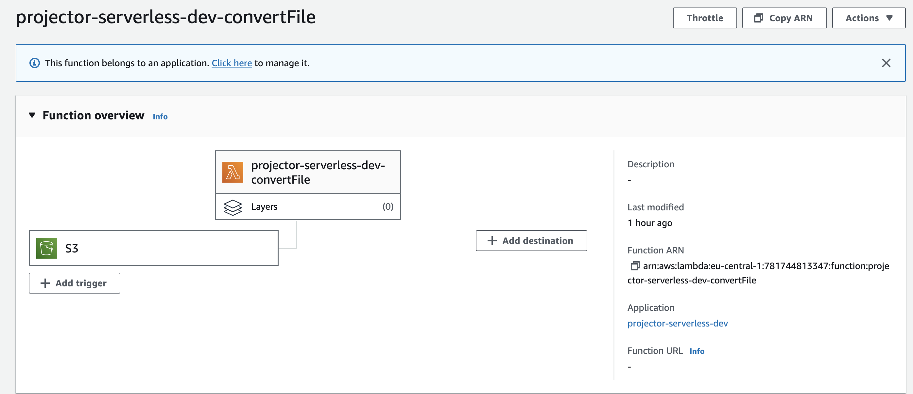
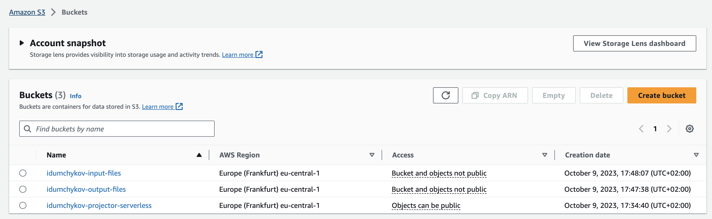
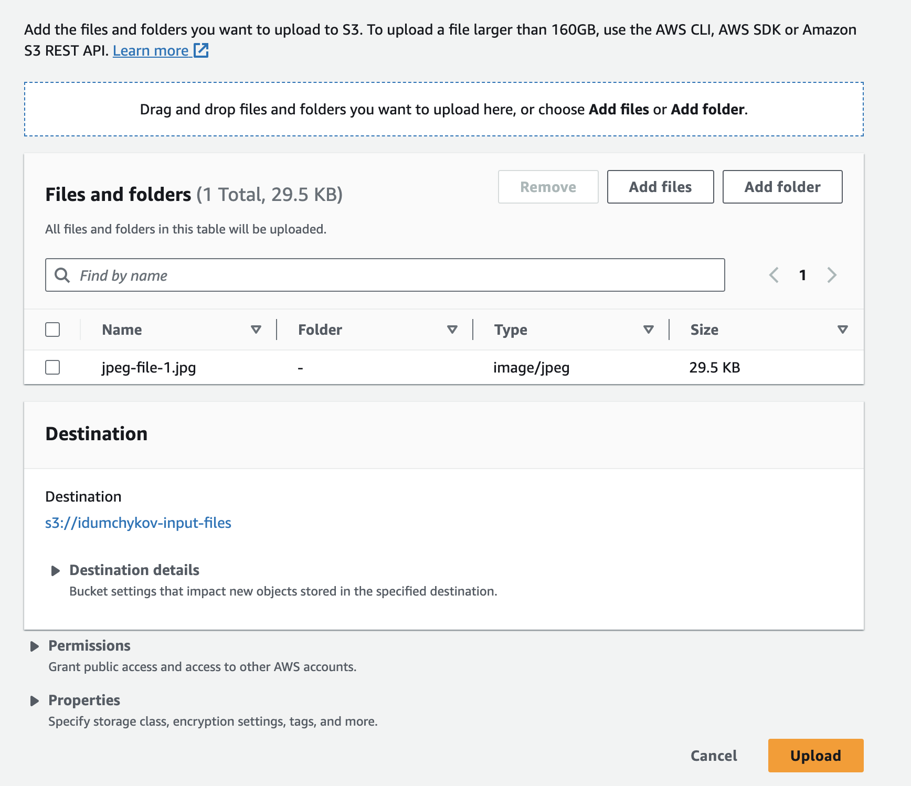
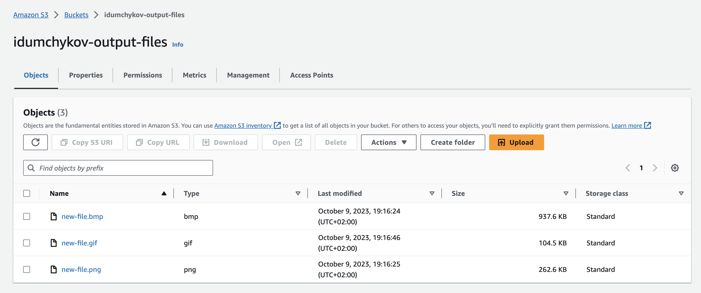

# projector-serverless

- Reads JPEG file from AWS S3 bucket
- Converts JPEG files to BMP, PNG and GIF
- Saves new files to AWS S3 bucket

# Prerequisites

- [Nodejs 18.x](https://nodejs.org/en)
- [Serverless CLI](https://www.serverless.com/)

# Run
1. Create S3 bucket that serverless will use for deploying the stack
2. Run command:
```shell
sls deploy --stage dev --param region=eu-central-1 --verbose
```

# Clean up
1. Run command:
```shell
sls remove --stage dev  --verbose
```
2. Remove S3 bucket created for serverless

# Results

## Architecture


## S3 Buckets


## Input File Upload


## Output Files


